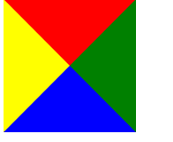
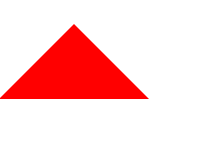
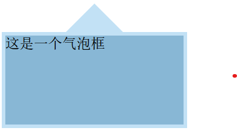
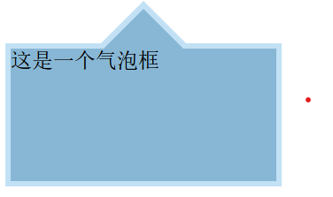

https://cssarrowplease.com/
# 实现原理
好的！我们通过一个实际的 `<div>` 元素示例，一步一步演示如何用 CSS 生成三角形，并最终实现双色箭头效果。以下是超详细解释：

---

### **第一步：基础 HTML 结构**
假设我们有如下 HTML：
```html
<div class="arrow_box">这是一个气泡框</div>
```

---

### **第二步：设置容器样式**
先给容器添加基础样式：
```css
.arrow_box {
  width: 200px;
  height: 100px;
  background: #88b7d5;    /* 背景色 */
  border: 4px solid #c2e1f5; /* 边框色 */
  position: relative;     /* 为伪元素定位提供基准 */
}
```


此时效果如下：  


---

### **第三步：理解三角形生成原理**
#### 实验 1：零宽高元素 + 四边边框
添加一个普通 `<div>` 观察边框交汇效果，这个相当于把盒子模型的内容设置为空，然后扩大border,border的上下左右都是一个梯形而这个梯形的内边（靠近内容的那一部分）就与内容的对应宽度一样，那这个宽度为0时，内边就成为0了，就变成三角形了。

以div为例，设置如下样式,内容为空：


```html
<div class="triangle"></div>
```
```css
.triangle {
  width: 0;
  height: 0;
  border: 50px solid;
  border-color: red green blue yellow;
}
```

• **结论**：零宽高元素 + 四边不同颜色边框 → 四个三角形交汇。

此时继续修改上左右的颜色为透明，只保留下border的颜色，

```css
   .triangle {
       width: 0;
       height: 0;
       border: 50px solid transparent; /* 四边透明 */
       border-bottom-color: red; /* 仅底部红色 */
   }
```
效果如下：  


• **结论**：单边边框着色 → 生成纯色三角形。

---

### **第四步：为容器添加箭头**
现在回到 `.arrow_box`，arrow_box的基本css样式如下：

```css
.arrow_box {
  width: 200px;
  height: 100px;
  background: #88b7d5;    /* 背景色 */
  border: 4px solid #c2e1f5; /* 边框色 */
  position: relative;     /* 为伪元素定位提供基准 */
}
```
我们希望在这个容器中添加一个箭头，箭头位于容器顶部外侧，并且箭头与容器边框颜色一致，用伪元素生成箭头。

---

#### 步骤 1：添加外层箭头（边框色）
```css
.arrow_box::before {
  content: "";           /* 伪元素必须设置 content */
  position: absolute;    /* 绝对定位 */
  bottom: 100%;          /* 定位到容器顶部外侧 */
  left: 50%;             /* 水平居中起始点 */
  border: 36px solid transparent;  /* 透明边框 */
  border-bottom-color: #c2e1f5;    /* 底部边框色（与外框同色） */
  margin-left: -36px;    /* 向左回退 36px（边框宽度） */
}
```
定位方式解析：
在 CSS 中，当父元素（`.arrow_box`）设置 `position: relative` 时，它的核心作用是 **为子元素的绝对定位（`position: absolute`）提供一个定位基准**。以下是详细解释：

---

#### **创建定位上下文（Positioning Context）**
• **默认情况**：如果一个元素的 `position` 是 `static`（默认值），它 **不会创建定位上下文**。
• **关键作用**：当父元素设置 `position: relative` 后，它会成为子元素（如伪元素 `::before`/`::after`）的 **定位基准**，子元素的 `top`/`left`/`right`/`bottom` 会相对于父元素的边界进行定位。
#### **不破坏父元素的原始布局**
• `position: relative` 的独特之处在于：
• **保持文档流**：父元素仍占据原始位置和空间（不像 `absolute` 或 `fixed` 会脱离文档流）。
• **无需偏移**：即使不设置 `top`/`left` 等偏移属性，父元素的位置也不会改变。
```css
.arrow_box {
    width: 200px;
    height: 100px;
    background: #88b7d5;    /* 背景色 */
    border: 4px solid #c2e1f5; /* 边框色 */
    position: relative;     /* 为伪元素定位提供基准 */
}
.arrow_box::before {
    content: "";           /* 伪元素必须设置 content */
    position: absolute;    /* 绝对定位 */
    bottom: 100%;          /* 定位到容器顶部外侧 */
    left: 50%;             /* 水平居中起始点 */
    border: 36px solid transparent;  /* 透明边框 */
    border-bottom-color: #c2e1f5;    /* 底部边框色（与外框同色） */
    margin-left: -36px;    /* 向左回退 36px（边框宽度） */
}
```


这里的定位方式absolute 以及bottom left的定位初始状态是与arrow_box元素的内容的左下点重叠，然后bottom就是距离arrow_box的下方100%的距离（放在这个元素上方）,left就是这个伪元素的左侧距离arrow_box的左侧50%，这个时候会超过中心的位置，通过margin-left: -36px; 将伪元素向左移动自身宽度的一半（`36px`），实现水平居中。

  
效果如下：  


• **关键点**：
• `margin-left: -36px` 将伪元素向左移动自身宽度的一半（`36px`），实现水平居中。

---

#### 步骤 2：添加内层箭头（背景色）
与上一步的添加逻辑相似，只不过三角形的大小进行了改变。
```css
.arrow_box::after {
  content: "";
  position: absolute;
  bottom: 100%;
  left: 50%;
  border: 30px solid transparent;    /* 更小的边框宽度 */
  border-bottom-color: #88b7d5;      /* 与容器背景同色 */
  margin-left: -30px;     /* 向左回退 30px（边框宽度） */
}
```
效果如下：


• **关键点**：
• 内层箭头（`30px`）比外层（`36px`）小，覆盖后露出外层边框的 `6px`（`36-30=6px`），形成边框效果。

---

### **第五步：完整代码**
```css
.arrow_box {
  width: 200px;
  height: 100px;
  background: #88b7d5;
  border: 4px solid #c2e1f5;
  position: relative;
}

.arrow_box::before,
.arrow_box::after {
  content: "";
  position: absolute;
  bottom: 100%;    /* 定位到容器顶部外侧 */
  left: 50%;       /* 水平居中起始点 */
  border: solid transparent;
  pointer-events: none; /* 防止箭头遮挡下方点击事件 */
}

.arrow_box::before {
  border-width: 36px;      /* 外层箭头大小 */
  border-bottom-color: #c2e1f5; /* 与外边框同色 */
  margin-left: -36px;      /* 回退自身宽度的一半 */
}

.arrow_box::after {
  border-width: 30px;      /* 内层箭头大小 */
  border-bottom-color: #88b7d5; /* 与背景同色 */
  margin-left: -30px;      /* 回退自身宽度的一半 */
}
```
---

### **总结**
• **三角形生成**：零宽高元素 + 单边边框着色。

• **双色箭头**：两个三角形叠加（外层大边框色 + 内层小背景色）。

• **定位技巧**：`bottom: 100%` + `left: 50%` + 负边距 → 箭头居中。

• **position: absolute 的作用**：伪元素脱离文档流，相对于最近的非 static 定位的祖先元素即 .arrow_box）进行定位。
父元素 .arrow_box 必须设置为 position: relative 或 absolute/fixed，否则伪元素会相对于 <body> 定位。
通过这种技巧，你可以用纯 CSS 实现各种箭头、气泡框、工具提示等效果！